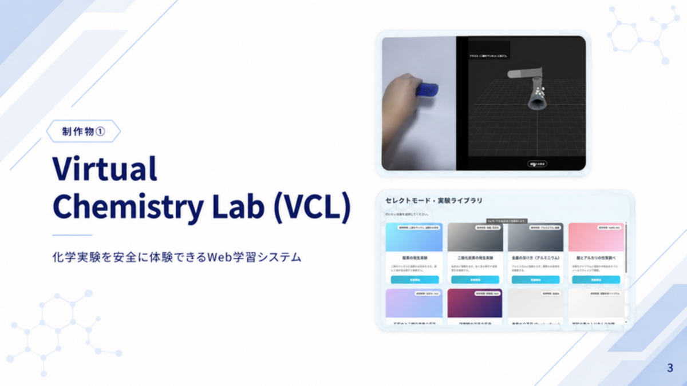
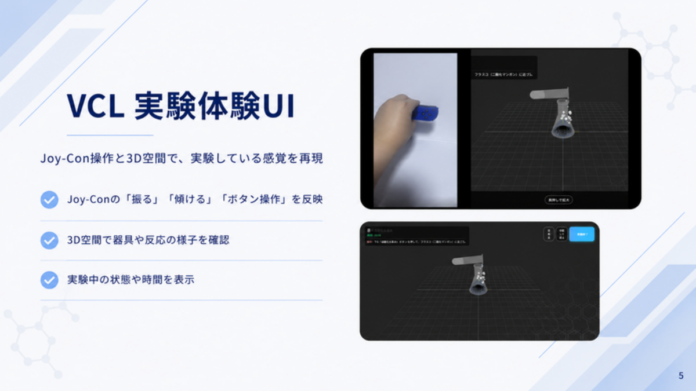
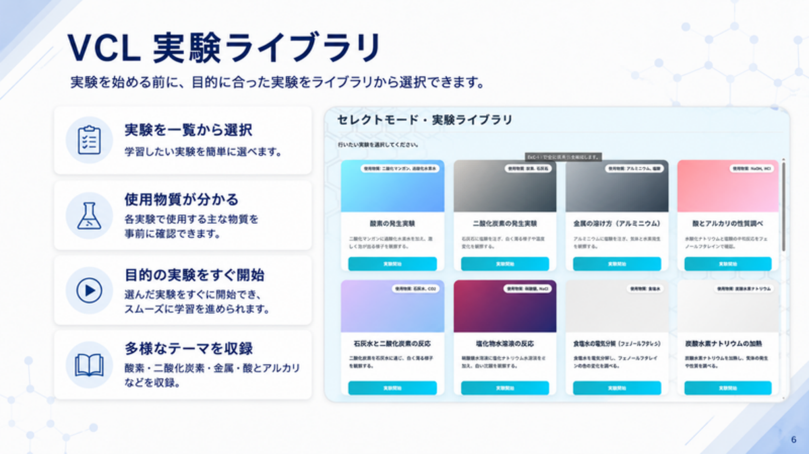
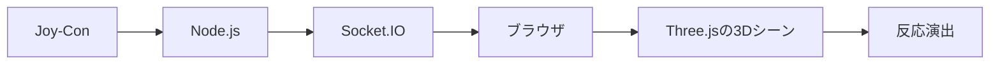
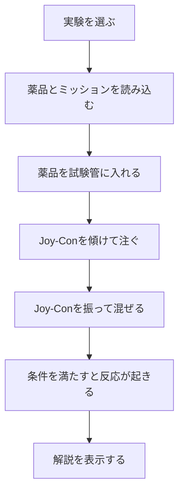

# VCL

VCLは、理科実験を体験的に学べるWebアプリケーションです。

化学は暗記で点数を取ることもできます。ただ、自分には短期記憶を繰り返している感覚がありました。英語に映画や会話のような体験の入口があるように、化学にも「見て、動かして、反応を体験する」学び方があれば、記憶に残りやすいのではないかと考えました。

そこで、実際の薬品を使わなくても、注ぐ、混ぜる、反応を見るという流れをWeb上で体験できるアプリとしてVCLを制作しました。

## 概要

- 対象: 小学校高学年から中学生
- 目的: 化学を丸暗記ではなく、体験しながら理解できるようにする
- 制作期間: 2025年8月から2026年7月
- 制作形式: 学校のチーム制作
- 成果: 学内コンテスト金賞
- 補足: チーム開発のため、ソースコード本体は非公開です

## 使用技術

- フロントエンド: JavaScript, Three.js
- バックエンド: Node.js
- リアルタイム通信: Socket.IO
- 外部デバイス入力: Joy-Con
- 保存設計: LocalStorage, Supabaseを使った進捗保存設計

## 自分の担当

- 4人チームのリーダー
- 仕様整理
- 役割分担
- 技術選定
- 入力方式の検証
- Joy-Conを使った操作体験の方針決定
- Node.jsとSocket.IOによるリアルタイム連携の実装方針整理
- 実験定義を `quests.js` に集約する設計方針の整理
- 発表時に伝わる見せ方の調整

## Joy-Conを選んだ理由

最初からJoy-Conに決めていたわけではありません。

実験操作を自然に入力する方法として、画像認識、QRコード検出、RGBによる色検出、マイコンとジャイロセンサーなども検討しました。しかし、画像認識系は照明や背景の影響を受けやすく、マイコン案もセンサー値の安定性に課題がありました。

最終的に、傾ける、振るといった操作を比較的安定して取得しやすく、実験器具を扱っている感覚も出しやすいJoy-Conを採用しました。

## 画面イメージ

## システム構成

## 利用の流れ

## 工夫した点

### 入力方式を複数検証したこと

単に思いついた方式を採用するのではなく、複数の入力方法を試し、安定性、操作感、実装難易度を比較しました。最終的にJoy-Conを採用したことで、注ぐ、振る、混ぜるという身体的な操作を作りやすくなりました。

### 反応を3D表現に落とし込んだこと

化学反応を完全な物理・化学シミュレーションとして再現するのではなく、中学生向けに「何を混ぜると、どんな変化が起きるか」が分かるよう、泡、色変化、沈殿、溶解などの観察結果を3D演出として表現しました。

### チームで判断理由を揃えたこと

リーダーとして、技術選定や仕様の理由をチーム内で共有し、メンバーが同じ方向を向いて進められるように意識しました。実装だけでなく、なぜその方式にするのかを言語化することを大切にしました。

## 学んだこと

技術選定は「新しさ」だけではなく、目的、安定性、チームの実装可能性から考える必要があると学びました。

また、ユーザーが体験として理解できるものを作るには、機能を並べるだけでは不十分です。操作の気持ちよさや、見た瞬間に何が起きているか分かる表現まで考える必要があると感じました。

## 今後の改善

- フリーモードの反応判定
- Joy-Conの割り当て選択
- 接続トラブル時の案内
- 実験数の追加
- 先生向けの進捗管理画面

## 補足

このリポジトリは、チーム開発で制作したVCLの公開可能な範囲をまとめたものです。ソースコード本体はチーム開発のため非公開とし、背景、担当範囲、設計判断、学びを中心に記録しています。
